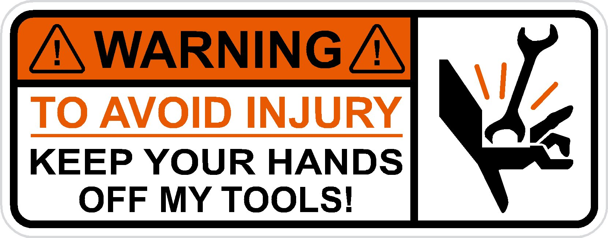
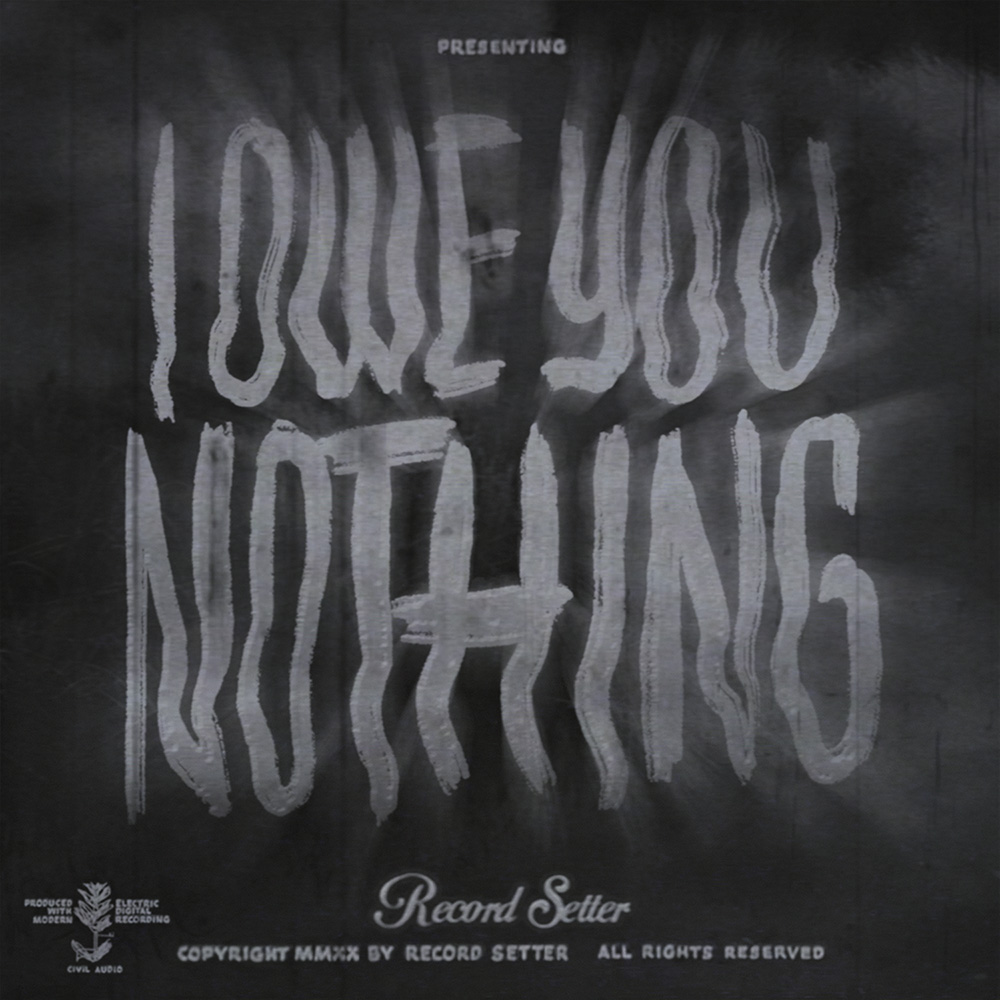

# Tool Tips

- 1. All works contained within 'github.com/joshuacline' are the intellectual property of Joshua Cline, All Rights Reserved.
- 
- Sad having to mention this, however, due to certain recent events, no other choice remains.
- I take pride in being a Microsoft Wiki Author & Editor. Anyone attrmpting to hijack this account won't get far, as Microsoft is the parent company of Github.
- https://www.youtube.com/watch?v=YU5vM4VSB3A

- 2. Favor me not.
- There's an underlying reason behind a developer who's never asked for advice, directions, guidance, protection, donuts, astroturfing, munitions, or guardian angels. Bet you can guess.
- 
- https://www.youtube.com/watch?v=YEkC40aM_o0

- 3. Do what thou wilt
- 
- The developer is not, cannot, and will not be held responsible for associated actions or damages related but not limited to unauthorized usage, zombie hordes, rouge agencies, governments, corporations, gang warfare, scam artistry, leisurely strolls, clandestine operations, natural disasters, or any other 'acts of god'.

- 4.
